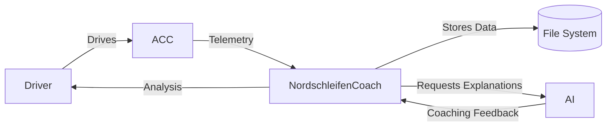

# 02 – System Context

**Status:** Draft
**Version:** 0.1
**Last Updated:** 2026-07-22

---

# Purpose

This document describes the external environment of Nordschleifen Coach.

It defines which external systems interact with the application, what data is exchanged, and where the system boundaries are.

The goal is to establish a clear understanding of the project's scope before describing the internal architecture.

---

# System Boundary

Nordschleifen Coach is responsible for:

* Collecting telemetry data
* Storing raw session data
* Processing telemetry
* Extracting driving features
* Evaluating driving skills
* Tracking driver progress
* Generating training recommendations
* Presenting results to the user

The system does **not** control the simulator or the vehicle.

---

# External Systems

## Assetto Corsa Competizione

Provides telemetry data during driving sessions.

Responsibilities:

* Vehicle simulation
* Physics
* Telemetry generation
* Session management

Nordschleifen Coach only consumes telemetry and does not modify the simulator.

---

## File System

Stores:

* Raw telemetry
* Processed data
* Configuration
* Reference data
* Logs

---

## AI Provider

Provides natural-language explanations and coaching recommendations.

Responsibilities:

* Explain analysis results
* Summarize findings
* Generate personalized coaching advice

The AI does **not** calculate telemetry metrics or driving scores.

---

## Driver

The primary user of the system.

Responsibilities:

* Drive sessions
* Review analyses
* Follow training recommendations
* Track long-term improvement

---

# Data Flow

## Input

* Telemetry
* Session information
* Vehicle information
* Track information
* User configuration

## Output

* Feature values
* Skill evaluations
* Progress metrics
* Coaching recommendations
* Dashboard visualizations

---

# System Context Diagram

---

# Assumptions

* Assetto Corsa Competizione provides sufficient telemetry for analysis.
* The telemetry interface remains stable across supported versions.
* AI services may change over time and should therefore remain replaceable.

---

# Design Principles

* External systems are loosely coupled.
* Telemetry remains the single source of truth.
* AI is an optional layer on top of deterministic analysis.
* The architecture should support additional simulators in the future without major redesign.

---

# Summary

Nordschleifen Coach sits between the simulator and the driver.

It transforms raw telemetry into measurable insights and actionable coaching while remaining independent of the simulator's internal implementation.
