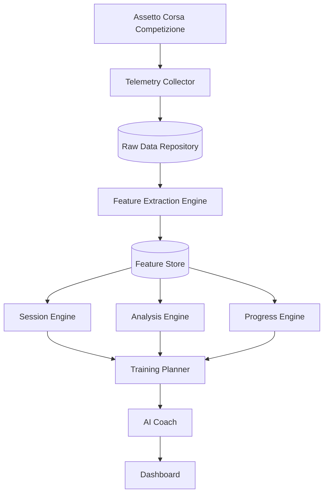

# 03 – System Overview

**Status:** Draft
**Version:** 0.1
**Last Updated:** 2026-07-22

---

# Purpose

This document describes the high-level architecture of Nordschleifen Coach.

It defines the major system components, their responsibilities, and how data flows through the system.

Implementation details are intentionally excluded.

---

# Architectural Principles

The architecture follows these principles:

* Single Responsibility
* Loose Coupling
* High Cohesion
* Deterministic Analysis before AI
* Data First
* Modular Design
* Extensibility

Each component has exactly one primary responsibility.

---

# High-Level Architecture

---

# Component Responsibilities

## Telemetry Collector

Responsible for acquiring telemetry from Assetto Corsa Competizione.

Output:

* Raw session data

---

## Raw Data Repository

Stores telemetry exactly as received.

Responsibilities:

* Persistence
* Data integrity
* Reproducibility

Raw data is never modified.

---

## Feature Extraction Engine

Transforms telemetry into measurable features.

Examples:

* Brake pressure
* Entry speed
* Apex speed
* Exit speed
* Steering smoothness
* Throttle modulation

---

## Feature Store

Stores calculated features.

The Feature Store acts as the single source of truth for all higher-level analyses.

Features are calculated once and reused throughout the system.

---

## Session Engine

Organizes telemetry into:

* Sessions
* Stints
* Laps
* Sections
* Segments

Provides navigation through recorded driving data.

---

## Analysis Engine

Detects driving patterns and weaknesses.

Examples:

* Late braking
* Early throttle
* Understeer
* Oversteer
* Line inconsistency

---

## Progress Engine

Tracks long-term development.

Responsibilities:

* Skill trends
* Consistency
* Historical comparison
* Performance evolution

---

## Training Planner

Combines analysis and progress information.

Produces prioritized training objectives.

Example:

> Improve trail braking in Adenauer Forst before focusing on apex speed.

---

## AI Coach

Explains analysis results in natural language.

Responsibilities:

* Coaching feedback
* Session summaries
* Practice recommendations

The AI does not calculate telemetry metrics.

---

## Dashboard

Provides the user interface.

Displays:

* Sessions
* Features
* Skills
* Trends
* Recommendations

---

# Data Flow

The system follows a one-way processing pipeline:

1. Collect telemetry
2. Store raw data
3. Extract features
4. Store features
5. Analyze driving
6. Measure progress
7. Generate training plan
8. Explain results
9. Present to the user

---

# Design Decisions

## Raw Data is Immutable

Raw telemetry is never modified.

All derived information is stored separately.

---

## Feature Store

Every higher-level component consumes the same calculated features.

This avoids duplicated calculations and guarantees consistent analysis.

---

## AI is the Final Layer

AI interprets deterministic results.

It never replaces the analysis pipeline.

---

# Summary

Nordschleifen Coach is organized as a pipeline of independent components.

Each component performs one well-defined task, making the system easier to understand, test, extend, and maintain.
