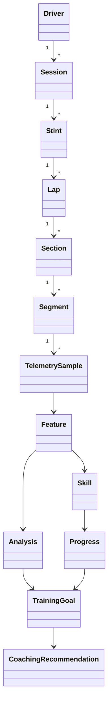

# 04 – Domain Model

**Status:** Draft
**Version:** 0.1
**Last Updated:** 2026-07-22

---

# Purpose

This document defines the business domain of Nordschleifen Coach.

It describes the core concepts used throughout the system without referring to implementation details.

The domain model serves as the common language for architecture, implementation, testing, and documentation.

---

# Core Domain Concepts

## Driver

Represents a person using Nordschleifen Coach.

A driver performs sessions and develops skills over time.

---

## Session

A complete driving activity.

A session contains one or more stints.

Example:

Practice Session

---

## Stint

A continuous period of driving.

A stint contains multiple laps.

---

## Lap

One completed circuit of a track.

A lap consists of multiple track sections.

---

## Track

A racing circuit.

Example:

* Nürburgring 24h

A track contains sections.

---

## Section

A recognizable part of a track.

Examples:

* Hatzenbach
* Flugplatz
* Schwedenkreuz
* Bergwerk
* Karussell

A section contains one or more segments.

---

## Segment

The smallest analysis unit.

Examples:

* Entry
* Turn-In
* Apex
* Exit

Segments are where telemetry is evaluated.

---

## Telemetry Sample

A single measurement captured during driving.

Examples:

* Speed
* Brake pressure
* Throttle
* Steering angle
* Gear
* RPM
* Position
* Time

Telemetry samples are immutable.

---

## Feature

A measurable property derived from telemetry.

Examples:

* Entry Speed
* Brake Release Rate
* Apex Speed
* Steering Smoothness
* Exit Acceleration

Features are deterministic.

---

## Skill

A driving capability inferred from multiple features.

Examples:

* Braking
* Trail Braking
* Corner Entry
* Rotation
* Throttle Control
* Racing Line
* Consistency

Skills evolve over time.

---

## Analysis

The interpretation of one or more features.

Examples:

* Braking too late
* Early throttle application
* Steering instability

Analysis identifies strengths and weaknesses.

---

## Progress

Historical development of one or more skills.

Progress compares results across many sessions.

---

## Training Goal

A concrete objective for future practice.

Example:

Improve trail braking consistency in Adenauer Forst.

Training goals are generated from analysis and progress.

---

## Coaching Recommendation

A human-readable explanation produced by the AI Coach.

Recommendations are based entirely on deterministic analysis.

---

# Domain Relationships

---

# Domain Rules

* Raw telemetry never changes.
* Features are deterministic.
* Skills are inferred from features.
* Progress is measured across sessions.
* AI never invents telemetry values.
* Coaching recommendations always reference measurable data.

---

# Ubiquitous Language

The following terms have one precise meaning throughout the project:

* Driver
* Session
* Stint
* Lap
* Track
* Section
* Segment
* Telemetry Sample
* Feature
* Skill
* Analysis
* Progress
* Training Goal
* Coaching Recommendation

These definitions should remain consistent across documentation, code, tests, and user interface.
